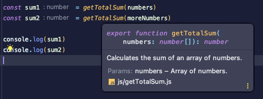

# Coding challenge for frontend developer

### Table of Contents:
- Test HTML and CSS
- Test Javascript

## Test HTML, CSS3 and SASS

In this test the HTML architecture of the following wireframe will be made:


And this was the final result


For the resolution we combined the CSS architecture of *BEM* (block element modifier) and the SASS preprocessor, 
making use of some of its functionalities for the structure of folders **(partials)** and for the definition of variables 
and code usability **(@use, @forward)**.

A more extensive explanation will be provided in the code review.

> Additional note: Since the wireframe font was not provided, I tried to use a font as close to the design as possible.

## Test Javascript

A `package.json` was created to provide a simpler way of obtaining the results and to be able to use `ESModules`.
```
for check the solution:  npm run start
for the original file:   npm run test 
```

For the javascript test I thought the best way was to abstract the main functionality 
to a separate module to improve its reusability. This can be found inside `js/getTotalSum.js`

```javascript
/**
 * Calculates the sum of an array of numbers.
 * @param {number[]} numbers - Array of numbers.
 * @returns {number}
 */
export function getTotalSum(numbers) {
    const isArray = !Array.isArray(numbers)
    const containsOnlyNumbers = numbers.every((number) => typeof number === 'number')

    if (!isArray || !containsOnlyNumbers) {
        throw new Error('Incorrect parameters: please enter an array of numbers')
    }

    return numbers.reduce((previousValue, currentValue) => {
        return previousValue += currentValue
    }, 0)
}
```

The method consists of 3 parts: **Documentation, check & solution**
1. **Documentation:** Since the challenge is with vanilla JS and no strict typing is available, I added [JSDoc](https://jsdoc.app/) to have a visual help by our IDE as shown in the image.


   


2. **Check:** Since we are not using `Typescript` with its strict typing (which would warn us of typing errors, e.g. incorrect parameters, at compile time) some basic checks were added to ensure the correct operation of the method. They could have been written in a single line but I preferred to increase the readability of the code by abstracting the checks.


3. **Solution:** After verifying that the values we receive are the correct ones, I used the `reduce` method of the arrays to do the total sum. **There are several ways to do this** and it will be discussed in detail in the code review.

To conclude, the file `js/js-test.js` contains the import of the module mentioned above and the implementation following the example of the test file:

```javascript
import { getTotalSum } from './getTotalSum.js'

const numbers = [10, 23, 4, 3]
const moreNumbers = [4, 9, 20, 16, 88]

const sum1 = getTotalSum(numbers)
const sum2 = getTotalSum(moreNumbers)

console.log(sum1) // 40
console.log(sum2) // 137
```

Additionally, the definition of variables could be changed from `let` to `const` and thus be a little more efficient, since const variables do not contain the method *setter* and of course following the good practices of immutability.

Made with 💚 by Daniel Muñoz